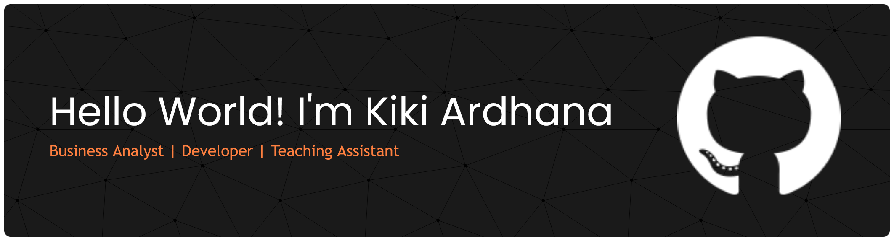

### 👨‍💻 About Me

I'm a **Sistem Informasi student** interested in **business, technology, and data**.

I enjoy understanding problems, figuring out what needs to be built, and turning ideas into practical solutions.

Currently exploring **Business Analysis, Data Analytics, and web development** through hands-on projects.

🌱 Learning by Building |
⚡ VibeCoder |
🧑‍💻 Code Enthusiast |
🛠️ Building & Breaking Things |
💻 Turning Ideas into Code |
☕ Fueled by Coffee & Code |

### Connect with me

 

### Languages & Framework

             

### My Github Stats

 

### 🐍 Contribution Snake

<picture>
  <source media="(prefers-color-scheme: dark)" srcset="https://raw.githubusercontent.com/KikiArdhana/KikiArdhana/output/github-contribution-grid-snake-dark.svg">
  <source media="(prefers-color-scheme: light)" srcset="https://raw.githubusercontent.com/KikiArdhana/KikiArdhana/output/github-contribution-grid-snake.svg">
  
</picture>

